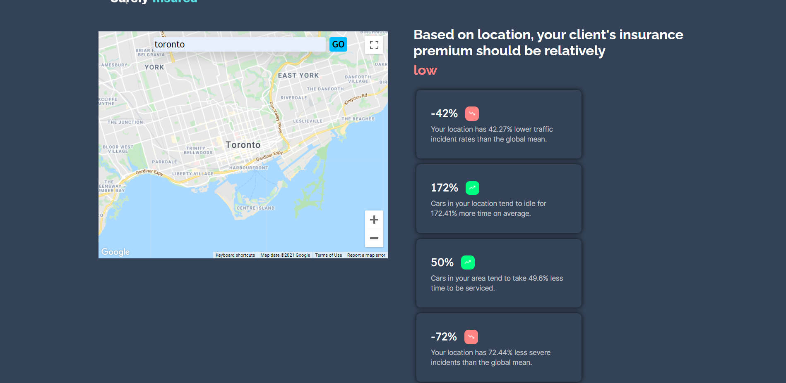

# Safely Insured

## Table of contents

- [Overview](#overview)
  - [The inspiration](#the-inspiration)
  - [What it does](#what-it-does)
- [Our process](#our-process)
  - [How we built it](#how-we-built-it)
  - [Challenges we ran into](#challenges-we-ran-into)
  - [Accomplishments that we're proud of](#accomplishments-that-we're-proud-of)

### Application Screenshots

#### Application Output

## Overview

### The inspiration
In today’s day and age, there are countless datasets available containing valuable information about any given location. This includes analytics based on urban infrastructures (dangerous intersections), traffic, and many more. Using these datasets and recent data analytics techniques, a modernized approach can be taken to support insurance companies with ideas to calculate effective and accurate premiums for their clients. So, we created Surely Insured, a platform that leverages this data and supports the car insurance industry. With the help and support from administrations and businesses, our platform can help many insurance companies by providing a modernized approach to make better decisions for pricing car insurance premiums.

### What it does
Surely Insured provides car insurance companies with a data-driven edge on calculating premiums for their clients.
Given a location, Surely Insured provides a whole suite of information that the insurance company can use to make better decisions on insurance premium pricing. More specifically, it provides possible factors or reasons for why your client's insurance premium should be higher or lower.

Moreover, Surely Insured serves three main purposes:

- Create a modernized approach to present traffic incidents and severity scores
- Provide analytics to help create effective insurance premiums
- Use the Google Maps Platform Geocoding API, Google Maps Platform Maps JavaScript API, and various Geotab Ignition datasets to extract valuable data for the analytics.

## Our Process

### How we built it
- We built the web app using React as the front-end framework and Flask as the back-end framework.
- We used the Google Maps Platform Maps Javascript API to dynamically display the map.
- We used the Google Maps Platform Geocoding API to get the latitude and longitude given the inputted address.
- We used three different Geotab Ignition datasets (HazardousDrivingAreas, IdlingAreas, ServiceCenterMetrics) to calculate metrics (with Pandas) based on the customer's location.

**Used technologies:** *React, Google Map Platform APIs, Flask*

### Challenges we ran into
- Integrating the Google Maps Platform JavaScript API and Google Maps Platform Geocoding API with the front-end was a challenge.
- There were a lot of features to incorporate in this project, given the time constraints. However, we were able to accomplish the primary purpose of our project, which was to provide car insurance companies an effective method to calculate premiums for their clients.
- Not being able to communicate face to face meant we had to rely on digital apps, which made it difficult to brainstorm concepts and ideas. This was exceptionally challenging when we had to work together to discuss potential changes or help debug issues.
- Brainstorming a way to combine multiple API prizes in an ambitious manner was quite a creative exercise and our idea had gone through multiple iterations until it was refined.

### Accomplishments that we're proud of
We're proud that our implementation of the Google Maps Platform APIs works as we intended. We're also proud of having the front-end and back-end working simultaneously and the overall accomplishment of successfully incorporating multiple features into one platform.

#### What we learned

- We learned how to use the Google Maps Platform Map JavaScript API and Geocoding API.
- Some of us improved our understanding of how to use Git for large team projects.

## License

This project is licensed under the MIT License - see the LICENSE.md file for details
